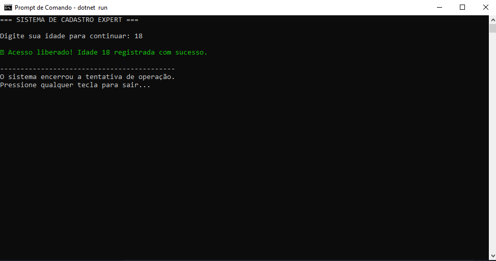
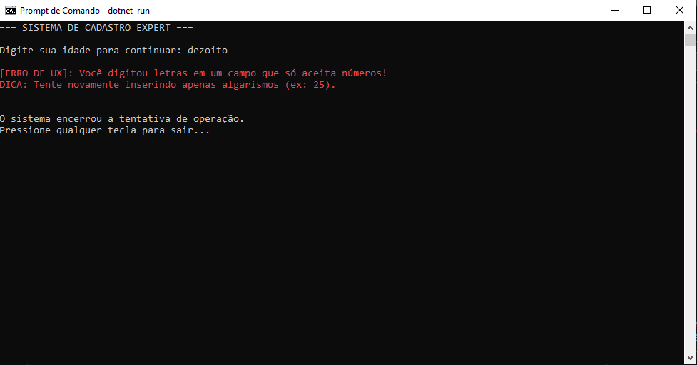

#🛡  Operação Escudo Digital

## 🧹Try-catch
- Try-catch é um mecanismo do Java para tratar erros.
- Ele evita que o programa quebre e permite tratar o problema de forma controlada (ex: mostrar mensagem ao usuário)

## 📦 Estrutura Gerada
Arquivos que o .NET criou para mim:
1. `Program.cs`: Onde fica o código.
2. `SistemaRobusto.csproj`: As configurações do meu projeto.

## 📸 Evidência de Execução

